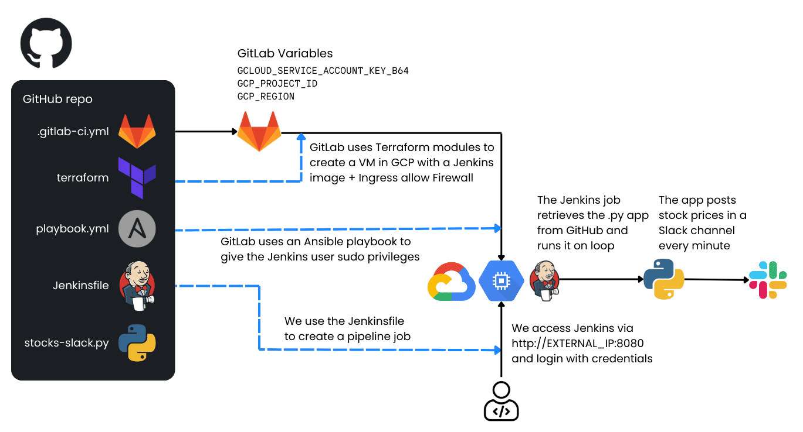

# GitLab-Ansible-Terraform-Jenkins-Python Workflow

## Overview
This project demonstrates how to automate the creation of a Jenkins server on a Google Cloud Platform (GCP) virtual machine (VM) using GitLab, Terraform, and Ansible. Once the Jenkins server is up and running, you can use it to execute a Python application that posts automated stock price messages into a Slack channel.

Below is an architectural diagram illustrating the process:



## How it Works
GitLab runs a CI/CD pipeline that:

- Uses Terraform to create:
  - A new VM instance in GCP with a preconfigured Jenkins image (from the GCP Marketplace).
  - A firewall rule allowing external access to Jenkins on port 8080.
- Uses Ansible to grant jenkins user privileges within the VM for running tasks with sudo.
- Jenkins is then accessible via `http://EXTERNAL_IP_OF_THE_VM:8080`
- You log into Jenkins with the provided credentials and create a Pipeline Job using the Jenkinsfile from this repository. This job:
  - Clones a Python application (stocks-slack-py) from GitHub.
  - Executes the Python app, which sends stock price messages to a specified Slack channel via a Slack webhook.

## Replication Steps
1. **Create a Slack Webhook**
   - Create a Slack channel for your stock messages.
   - Go to Slack API and create a new Slack App.
   - In your new Slack App, enable “Incoming Webhooks”.
   - Add a New Webhook to your workspace and specify the channel you created.
   - Copy the webhook URL, which typically looks like: `https://hooks.slack.com/services/XXXXXXXXX/XXXXXXXXX/XXXXXXXXXXXXXXXXXX`
   - Keep this URL safe. You will paste it later into your Jenkinsfile or pipeline configuration.

2. **Create a Service Account on GCP**
   - Go to the GCP Console → IAM & Admin → Service Accounts.
   - Create a new service account, giving it a descriptive name (e.g., gitlab-jenkins-sa).
   - Assign it the following roles:
     - Cloud OS Config Service Agent
     - Compute Admin
     - Compute OS Admin Login
     - Service Account User
     - Service Usage Admin
   - Create a JSON key for this service account (in the GCP Console, under “Keys” → “Add Key” → “Create new key” → Select JSON).
   - Download the JSON key file.

3. **Encode the JSON Key**
   - In your GCP Cloud Shell or any environment with base64 available, run:
     ```
     echo -n "PASTE JSON FILE CONTENTS HERE WITHOUT CHANGING ANYTHING" | base64
     ```
   - Copy the base64-encoded output. This is what you will store in GitLab as a variable.

4. **Set Up GitLab CI/CD Variables**
   - In GitLab, open your project and go to Settings → CI/CD.
   - Expand Variables.
   - Click Add Variable and create the following variables:
     - `GCLOUD_SERVICE_ACCOUNT_KEY_B64` → Paste the base64-encoded JSON key here.
     - `GCP_PROJECT_ID` → Use your GCP project ID (e.g., my-gcloud-project).
     - `GCP_ZONE` → Use your GCP zone (e.g., us-central1-a).
   - Save these variables.

5. **Trigger the GitLab CI/CD Pipeline**
   - Go to your repository in GitLab that contains the .gitlab-ci.yml file.
   - Open the CI/CD page and manually run the pipeline (or push a commit).
   - The pipeline will start, and GitLab will:
     - Use Terraform to create the VM.
     - Use Ansible to provision the Jenkins server within that VM.

6. **Get Jenkins Access Information**
   - Open the pipeline job logs in GitLab by clicking on the job under the CI/CD → Jobs page.
   - In the logs output, you should see:
     - The external IP of the VM.
     - The username and password to log into Jenkins.

7. **Log Into Jenkins**
   - Open a browser and navigate to: `http://EXTERNAL_IP_OF_THE_VM:8080`
   - Use the username and password from the GitLab job output to access Jenkins.

8. **Install the “Pipeline” Plugin in Jenkins**
   - In Jenkins, click “Manage Jenkins” (sometimes labeled “Admin Jenkins”) from the left menu.
   - Go to “Manage Plugins”.
   - Select “Available Plugins” and look for “Pipeline”.
   - Install the plugin (check the box, then install).
   - Wait until the installation completes, then return to the Jenkins homepage by clicking the Jenkins logo in the top-left corner.

9. **Create a Pipeline Job**
   - From the Jenkins homepage, click “New Item” (or “Create a Job”).
   - Enter a job name (e.g., stocks-slack-pipeline) and select “Pipeline”.
   - Scroll down to the Pipeline section.
   - In Definition, choose “Pipeline script”.
   - Paste the contents of the Jenkinsfile from this GitHub repository into the editor.
   - Replace the placeholder `INSERT WEBHOOK URL HERE` with your actual Slack webhook URL.
   - Click Save.

10. **Build the Pipeline**
    - On the left menu of your new pipeline job, click “Build Now”.
    - Watch the build progress. The Python app will run inside your Jenkins VM and send stock prices to the specified Slack channel.
    - After a couple of minutes, check your Slack channel to see the stock price messages.

Congratulations! You have replicated the workflow: `GitLab` → `Terraform` + `Ansible` → `Jenkins` → `Python` → `Slack`.

**Cleanup:** If you no longer need the VM, delete it to avoid unnecessary charges. To do this, navigate to **Compute Engine → VM Instances** in your GCP Console, locate the Jenkins VM, and click **Delete**.

**Customization:** You can extend this pipeline for other use cases, such as deploying containerized applications, running tests, or more complex automation tasks.

Happy Automating!

